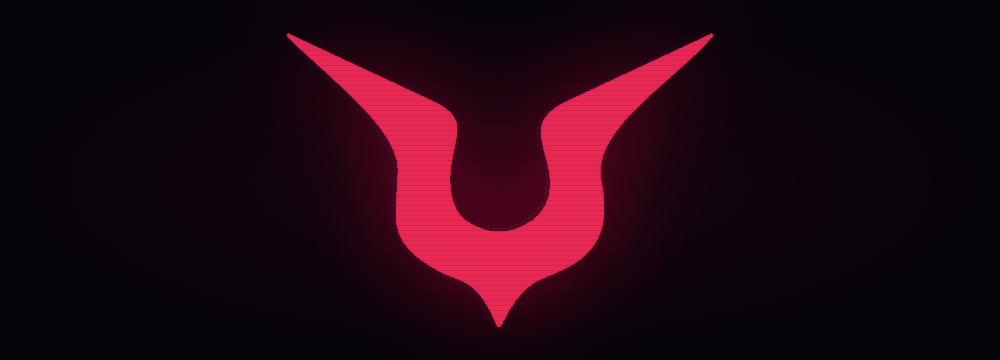
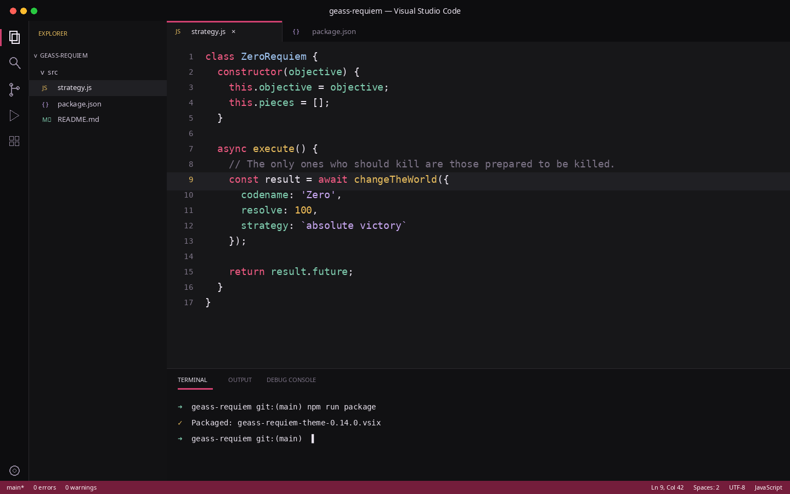
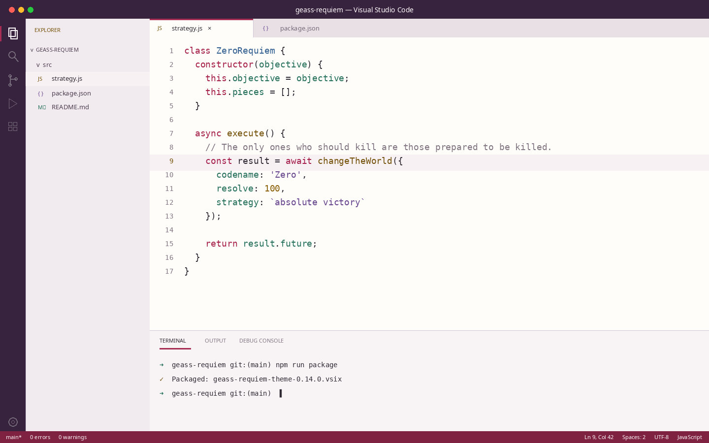
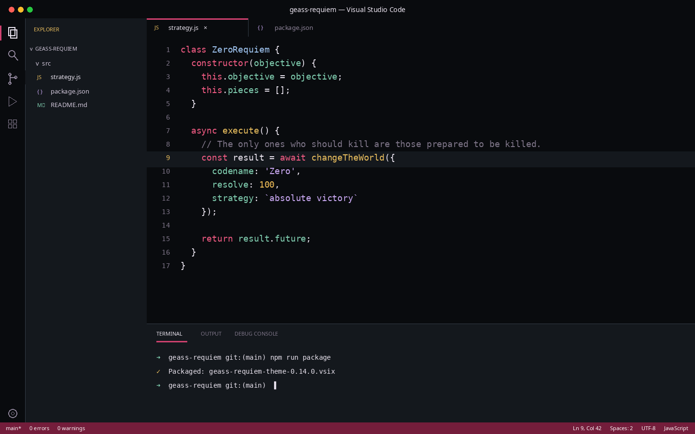
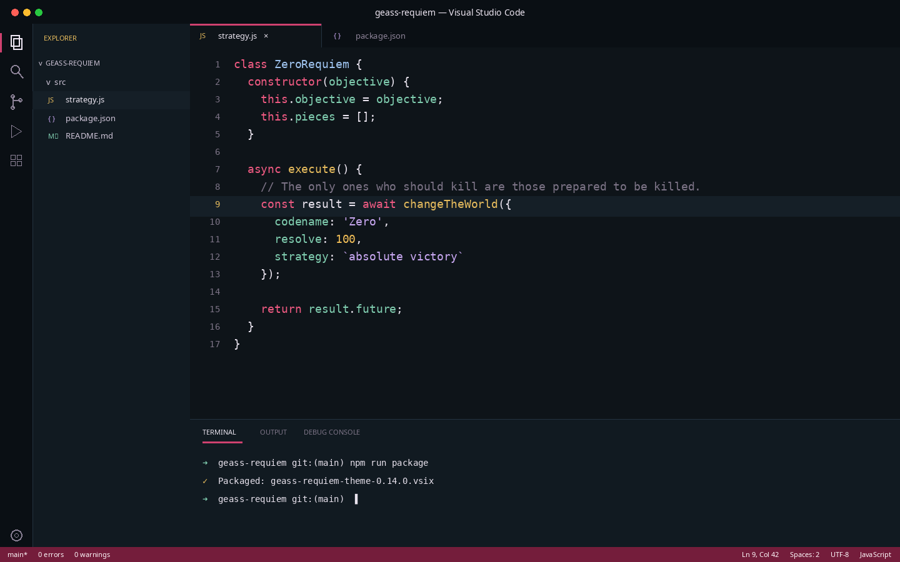
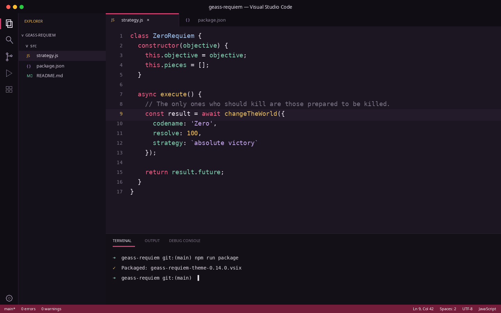

<div align="center">



<sub>Símbolo por <a href="https://commons.wikimedia.org/wiki/User:Koveras">Koveras</a>, adaptado sob <a href="https://creativecommons.org/licenses/by-sa/3.0/">CC BY-SA 3.0</a>.</sub>

# Code Geass

Uma experiência para **Visual Studio Code** inspirada em rebelião, estratégia,
realeza e no brilho sobrenatural do Geass: cinco temas de cores, um companion
interativo e um perfil de terminal opcional.

[](https://marketplace.visualstudio.com/items?itemName=davi-noah.geass-requiem-theme)
[](https://marketplace.visualstudio.com/items?itemName=davi-noah.geass-requiem-theme)
[](https://marketplace.visualstudio.com/items?itemName=davi-noah.geass-requiem-theme)
[](https://code.visualstudio.com/)
[](./LICENSE)

</div>

> Rebelião, realeza e uma variação obsidiana de inspiração metálica — com cores
> de interface, terminal e sintaxe pensadas como um único sistema visual.

## Temas

### Rebellion

Um tema escuro de alto contraste com fundo grafite, carmesim, ouro e
lavanda. Feito para sessões longas sem perder a presença dramática.



### Holy Britannia

Um tema claro de fundo marfim, vinho imperial, ouro envelhecido e violeta.
Mantém a mesma hierarquia visual de Rebellion sob uma luz mais nobre.



### Obsidian

Uma variação escura inspirada no tema Obsidiana do GymRank: preto azulado,
superfícies metálicas e bordas frias, preservando a sintaxe carmesim, dourada,
lavanda, azul e jade de Rebellion.



### Crimson Ayu

Uma versão da identidade carmesim de Rebellion sobre a base azul-petróleo do
Ayu para Kitty. Mantém os acentos de Code Geass e usa `#0E1419` no editor,
com superfícies derivadas do azul profundo do Ayu.



### Crimson Rebellion

A aparência clássica do projeto, preservada como um tema independente: fundo
ameixa `#1B1621`, barras vermelho-violeta e os acentos carmesim e dourado do
Geass. É a versão anterior ao fundo grafite do Rebellion atual.



## Geass Companion

Expanda **GEASS REQUIEM** no Explorer, junto de seções como Outline e Timeline.
Escolha entre **Zero**, **C.C.**, **Kallen** e **Suzaku**, além dos cenários
**Geass**, **Tóquio à Noite**, **Palácio de Britannia** e **Tabuleiro**. Cada
ambiente usa uma ilustração completa em pixel art, e cada personagem possui
falas próprias que também reagem ao cenário selecionado. O personagem usa
animações em quadros para caminhar, respirar e falar, descansa,
muda de direção e reage ao clique e ao comando
**Geass Requiem: Despertar o Geass** — uma experiência inspirada em extensões de
companions como VS Code Pets e VS Code Pokémon.

Os dois seletores ficam dentro da própria View. Também é possível usar os botões
no cabeçalho da seção ou os comandos **Trocar Personagem** e **Trocar Cenário**.
Os fundos em pixel art foram criados especialmente para a extensão e estão
creditados junto aos demais assets do projeto.

O companion é opcional. Seu tamanho e suas animações podem ser
alterados nas configurações `geassRequiem.companionSize` e
`geassRequiem.companionMotion`.

### Reações ao projeto

Zero, C.C., Kallen e Suzaku possuem falas próprias ao salvar arquivos, encontrar
ou corrigir erros, abrir o terminal e concluir tarefas. As reações têm um
intervalo para não interromper o trabalho e podem ser desativadas em
`geassRequiem.contextReactions`.

### Modo foco

Use o botão de relógio na View ou execute
**Geass Requiem: Iniciar ou continuar Pomodoro**.
O companion acompanha um ciclo Pomodoro completo, alternando foco, pausa curta
e pausa longa. A etapa e a quantidade de focos concluídos sobrevivem ao
recarregamento da janela.

O Pomodoro pode ser configurado por meio de:

- `geassRequiem.focusDuration`: duração do foco;
- `geassRequiem.shortBreakDuration`: pausa curta;
- `geassRequiem.longBreakDuration`: pausa longa;
- `geassRequiem.focusSessionsBeforeLongBreak`: focos antes da pausa longa;
- `geassRequiem.pomodoroAutoStartBreaks`: inicia pausas automaticamente;
- `geassRequiem.pomodoroAutoStartFocus`: inicia o próximo foco automaticamente;
- `geassRequiem.pomodoroNotifications`: controla as notificações.

O recurso inteiro pode ser desligado em `geassRequiem.focusMode`.

Todas as funcionalidades extras podem ser desligadas de uma vez por meio de
`geassRequiem.companionFeatures`.

### Afinidade e desbloqueios

Quando `geassRequiem.affinitySystem` está ativo, cada personagem possui seu
próprio vínculo de cinco níveis. Interações, reações do projeto, eventos raros e
sessões de foco concluídas concedem pontos e liberam falas mais pessoais. A
progressão fica salva localmente e não é enviada para nenhum serviço.

Nesta versão, os desbloqueios de afinidade são falas e mensagens de evolução.
Roupas, poses e sprites alternativos ainda não estão incluídos porque precisam de
quadros completos e consistentes para todas as animações de cada personagem.

### Estados emocionais

Os personagens podem ficar concentrados, confiantes, preocupados ou em
comemoração. O estado aparece na identificação do personagem e altera detalhes
visuais temporariamente. Essa camada pode ser desligada em
`geassRequiem.emotionalStates`.

### Interações avançadas

Com `geassRequiem.advancedInteractions` ativo, é possível arrastar o personagem,
usar clique duplo para uma ação especial e abrir um menu com o botão direito.
Cada personagem possui sua própria fala especial.

### Eventos raros

Zero, C.C., Kallen e Suzaku possuem acontecimentos exclusivos que aparecem em
intervalos aleatórios. Eles podem ser desligados em `geassRequiem.rareEvents`, e
a frequência pode ser ajustada em `geassRequiem.rareEventFrequency`.

## Geass Requiem Terminal

Execute **Geass Requiem: Abrir Terminal** ou escolha **Geass Requiem Terminal**
no seletor de perfis do terminal. O perfil preserva a configuração normal do
shell e aplica um prompt próprio:

```text
◈ ~/projeto ❯
```

O Geass usa carmesim, o diretório atual usa ouro e o indicador do comando usa
violeta. No Linux e macOS, o perfil abre Bash e carrega `~/.bashrc`; no Windows,
abre PowerShell. Nenhum arquivo de configuração do usuário é modificado.

## Instalação

### Pelo Marketplace

1. Abra o [Geass Requiem no Visual Studio Marketplace](https://marketplace.visualstudio.com/items?itemName=davi-noah.geass-requiem-theme).
2. Clique em **Install**.
3. No VS Code, execute **Preferences: Color Theme**.
4. Escolha **Rebellion**, **Holy Britannia**, **Obsidian**, **Crimson Ayu** ou **Crimson Rebellion**.

### Pelo terminal

```bash
code --install-extension davi-noah.geass-requiem-theme
```

Também é possível procurar por `Geass Requiem` diretamente na aba de extensões
do VS Code.

## Paleta de cores

### Rebellion

| Cor | Hex | Uso | Amostra |
| --- | --- | --- | --- |
| Graphite | `#171719` | Fundo do editor |  |
| Ivory | `#E9E3EE` | Texto principal |  |
| Geass | `#F05A82` | Palavras-chave |  |
| Imperial Gold | `#E7BC5D` | Funções e destaques |  |
| Lavender | `#C9A8F2` | Strings |  |
| Britannian Blue | `#9FC4F0` | Tipos e classes |  |
| Jade | `#80CEB0` | Propriedades |  |
| Crimson | `#FF5470` | Erros |  |

### Holy Britannia

| Cor | Hex | Uso | Amostra |
| --- | --- | --- | --- |
| Porcelain | `#FFFDF9` | Fundo do editor |  |
| Royal Ink | `#312B35` | Texto principal |  |
| Geass | `#A51F4B` | Palavras-chave |  |
| Antique Gold | `#75520A` | Funções e destaques |  |
| Imperial Violet | `#67458F` | Strings |  |
| Britannian Blue | `#315F91` | Tipos e classes |  |
| Jade | `#24705B` | Propriedades |  |
| Crimson | `#B91F42` | Erros |  |

### Obsidian

| Cor | Hex | Uso | Amostra |
| --- | --- | --- | --- |
| Obsidian | `#090B0E` | Fundo do editor |  |
| Steel | `#14181D` | Barras e painéis |  |
| Raised Steel | `#20262D` | Menus e widgets |  |
| Steel Border | `#343C46` | Bordas |  |
| Geass | `#F05A82` | Palavras-chave |  |
| Imperial Gold | `#E7BC5D` | Funções |  |

### Crimson Ayu

| Cor | Hex | Uso | Amostra |
| --- | --- | --- | --- |
| Ayu Background | `#0E1419` | Fundo do editor e terminal |  |
| Deep Surface | `#111A21` | Barras e painéis |  |
| Ayu Selection | `#243340` | Seleções e bordas |  |
| Geass | `#F05A82` | Palavras-chave |  |
| Imperial Gold | `#E7BC5D` | Funções |  |
| Lavender | `#C9A8F2` | Strings |  |

### Crimson Rebellion

| Cor | Hex | Uso | Amostra |
| --- | --- | --- | --- |
| Rebellion Plum | `#1B1621` | Fundo do editor |  |
| Imperial Shadow | `#15111B` | Barra lateral |  |
| Raised Plum | `#211A28` | Menus e widgets |  |
| Geass | `#F05A82` | Palavras-chave |  |
| Imperial Gold | `#E7BC5D` | Funções |  |

## Desenvolvimento

1. Clone ou abra este repositório no VS Code.
2. Pressione `F5` para iniciar uma janela de desenvolvimento de extensão.
3. Nessa janela, execute **Preferences: Color Theme**.
4. Selecione **Rebellion**, **Holy Britannia**, **Obsidian**, **Crimson Ayu** ou **Crimson Rebellion**.
5. Expanda **GEASS REQUIEM** na parte inferior do Explorer.
6. Execute **Geass Requiem: Abrir Terminal** para testar o prompt.

As cores ficam em [`themes/`](./themes/), o companion em
[`extension.js`](./extension.js) e os inicializadores do terminal em
[`terminal/`](./terminal/). Depois de alterar um tema ou recurso, recarregue a
janela de desenvolvimento para conferir o resultado.

### Gerar o pacote

```bash
npm run package
```

O comando gera um arquivo `.vsix` pronto para instalação.

## Contribuindo

Contribuições são bem-vindas. Para propor uma correção ou melhorar uma cor:

1. Crie um fork e uma branch para a mudança.
2. Ajuste o arquivo correspondente em [`themes/`](./themes/).
3. Teste os dois temas em uma janela de desenvolvimento com `F5`.
4. Abra um pull request explicando a motivação da alteração.

Ao mexer na paleta, preserve legibilidade, contraste e consistência entre os
equivalentes claro e escuro.

## Acessibilidade

As cores foram escolhidas para manter uma hierarquia legível em fundos claros e
escuros. Como extensões, linguagens e configurações do editor podem alterar o
realce final, contribuições com melhorias de contraste são especialmente úteis.

## Aviso

Este é um projeto independente, inspirado na atmosfera de *Code Geass*, e não
possui associação com os detentores da obra original. Nomes, personagens e marcas
citados pertencem aos seus respectivos titulares.

### Crédito das imagens

O GIF e o ícone da extensão são adaptações de
“[Geass.svg](https://commons.wikimedia.org/wiki/File:Geass.svg)”, criado por
[Koveras](https://commons.wikimedia.org/wiki/User:Koveras) e licenciado sob
[CC BY-SA 3.0](https://creativecommons.org/licenses/by-sa/3.0/). As adaptações
adicionam fundo, recoloração e brilho; o GIF também inclui scanlines sutis e um
pulso lento. Ambas são distribuídas sob a mesma licença. Consulte
[`assets/LICENSE.md`](./assets/LICENSE.md).

Essas imagens não fazem parte da licença MIT aplicada ao código deste projeto.

## Changelog

Veja o histórico de versões em [`CHANGELOG.md`](./CHANGELOG.md).

## Licença

[MIT](./LICENSE) © Geass Requiem contributors.
